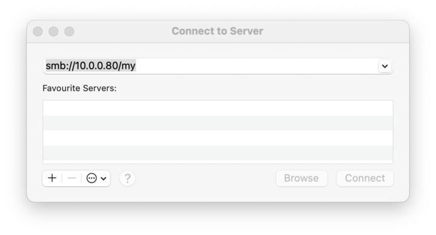
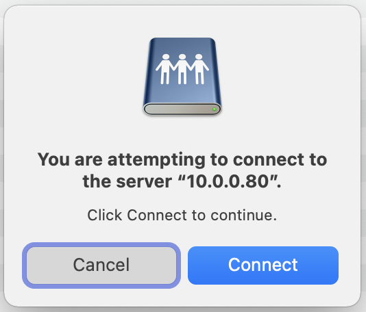
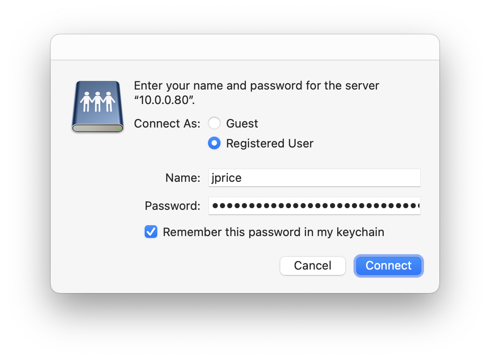

# Ansible Playbook for Initial Configuration of MacOS Big Sur on Apple Silicon

Bare in mind these instructions are specific to my own device and infrastructure. Regardless of that, do feel free to adapt this repository to your own needs.

## Mount Samba Share

Open **Finder**, and press `⌘ K` to open the "Connect to Server" window. Enter `smb://10.0.0.80/my` and click `Connect`.



Confirm the attempt to connect.



Then enter credentials for the share.



## Preparation

Open up the default Terminal, and type `pip3`. This will then prompt you to install `Command Line Developer Tools`.

Next, change the default shell to Bash (from Zsh):

```sh
chsh -s /bin/bash
```

Next, upgrade pip.

```sh
pip3 install --user --upgrade pip3
```

Restart the terminal, and then proceed with the next steps.

## Install Ansible

Install Ansible using the command below.

```sh
python3 -m pip install --user ansible
```

You may need to add the below PATH to `.bashrc`, if running `ansible` doesn't work straight away, as Ansible get's installed there.

```sh
export PATH="/Users/jpr/Library/Python/3.*/bin:$PATH"
```

## Install Homebrew

```sh
/bin/bash -c "$(curl -fsSL https://raw.githubusercontent.com/Homebrew/install/HEAD/install.sh)"
```
## Install Ansible Galaxy Collections

```sh
ansible-galaxy collection install community.general
```

## Optional Tasks

To avoid running certain tasks (such as Homebrew) which may take a while to run, a number of boolean variables are provided in `flags.yml`. 

By default they are all set to `false`.

For an actual intial configuration, or to make sure current software is up to date, the flags can be set to `true`.

```yml
# Download Ansible Galaxy Prerequisites:
download_galaxy: false

# Download applications that need manual installation:
download_apps: false

# Run Homebrew Packages:
run_homebrew_packages: false

# Run Homebrew Casks:
run_homebrew_casks: false

# Run Python pip:
run_pip: true
```

## Run Playbook

```sh
ansible-playbook --ask-become-pass playbook.yml
```

